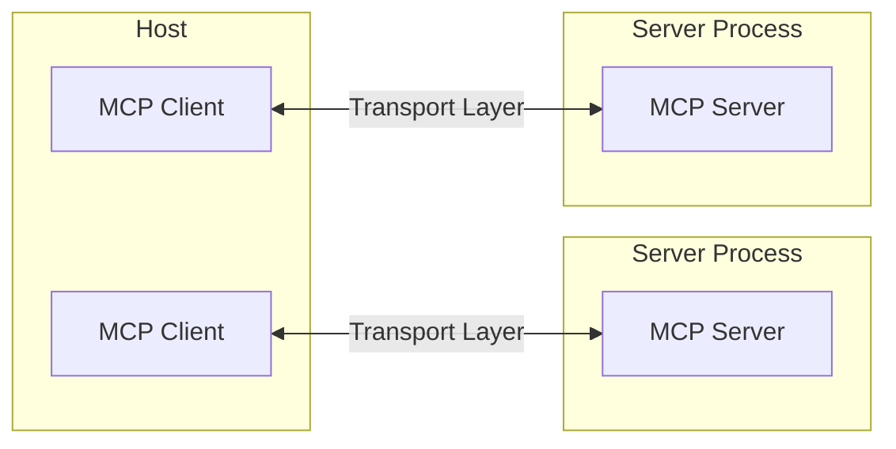

---
# You can also start simply with 'default'
theme: seriph
# random image from a curated Unsplash collection by Anthony
# like them? see https://unsplash.com/collections/94734566/slidev
background: https://cover.sli.dev
# some information about your slides (markdown enabled)
title: MCP 与应用实践
info: |
  ## Slidev Starter Template
  Presentation slides for developers.

  Learn more at [Sli.dev](https://sli.dev)
# apply unocss classes to the current slide
class: text-center
# https://sli.dev/features/drawing
drawings:
  persist: false
# slide transition: https://sli.dev/guide/animations.html#slide-transitions
transition: slide-left
# enable MDC Syntax: https://sli.dev/features/mdc
mdc: true
# open graph
# seoMeta:
#  ogImage: https://cover.sli.dev
---

#  MCP 与应用实践

<p>
分享人：刘明勋
</p>

<div class="abs-br m-6 text-xl">
  <button @click="$slidev.nav.openInEditor()" title="Open in Editor" class="slidev-icon-btn">
    <carbon:edit />
  </button>
  <a href="https://github.com/liumingxun/try-mcp" target="_blank" class="slidev-icon-btn">
    <carbon:logo-github />
  </a>
</div>

<!--
The last comment block of each slide will be treated as slide notes. It will be visible and editable in Presenter Mode along with the slide. [Read more in the docs](https://sli.dev/guide/syntax.html#notes)
-->

---
transition: fade-out
---

# ✅ MCP 是什么?
<v-clicks>
<li>MCP 是一个标准化协议：MCP 是一个开放的标准协议，目的是为大型语言模型（LLM）提供一个统一的上下文信息交互接口。</li>
<li>MCP 是一个架构设计规范：MCP 定义了主机、客户端和服务器之间的通信规则，使得信息可以高效且一致地在这些组件之间传递。</li>
</v-clicks>

---
transition: fade
---

# ❌ MCP 不是什么？
<v-clicks>
<li>MCP 不是 AI 模型实现：MCP 不是一种语言模型或人工智能算法，不提供任何终端用户交互功能。</li>
<li>MCP 不是具体的软件或工具：MCP 不是某个特定的软件包，而是一套开放的标准，开发者可以在自己的应用中实现这一协议。</li>
</v-clicks>

---
transition: slide-up
---

# 🚩 如何实现

<v-clicks>
<table style="border-collapse:collapse;border-color:#9ABAD9;border-spacing:0" class="tg"><thead><tr><th style="background-color:#409cff;border-color:inherit;border-style:solid;border-width:1px;color:#fff;font-family:Arial, sans-serif;font-size:14px;font-weight:bold;overflow:hidden;padding:10px 5px;text-align:center;vertical-align:top;word-break:normal">特点</th><th style="background-color:#409cff;border-color:inherit;border-style:solid;border-width:1px;color:#fff;font-family:Arial, sans-serif;font-size:14px;font-weight:bold;overflow:hidden;padding:10px 5px;text-align:center;vertical-align:top;word-break:normal">系统提示词</th><th style="background-color:#409cff;border-color:inherit;border-style:solid;border-width:1px;color:#fff;font-family:Arial, sans-serif;font-size:14px;font-weight:bold;overflow:hidden;padding:10px 5px;text-align:center;vertical-align:top;word-break:normal">工具调用</th></tr></thead>
<tbody><tr><td style="background-color:#EBF5FF;border-color:inherit;border-style:solid;border-width:1px;color:#444;font-family:Arial, sans-serif;font-size:14px;overflow:hidden;padding:10px 5px;text-align:left;vertical-align:top;word-break:normal">实现难度</td><td style="background-color:#EBF5FF;border-color:inherit;border-style:solid;border-width:1px;color:#444;font-family:Arial, sans-serif;font-size:14px;overflow:hidden;padding:10px 5px;text-align:left;vertical-align:top;word-break:normal">适中，直接在模型上下文中定义提示词</td><td style="background-color:#EBF5FF;border-color:inherit;border-style:solid;border-width:1px;color:#444;font-family:Arial, sans-serif;font-size:14px;overflow:hidden;padding:10px 5px;text-align:left;vertical-align:top;word-break:normal">较高，需要配置和调用外部 API 或服务</td></tr>
<tr><td style="background-color:#EBF5FF;border-color:inherit;border-style:solid;border-width:1px;color:#444;font-family:Arial, sans-serif;font-size:14px;overflow:hidden;padding:10px 5px;text-align:left;vertical-align:top;word-break:normal">灵活性</td><td style="background-color:#EBF5FF;border-color:inherit;border-style:solid;border-width:1px;color:#444;font-family:Arial, sans-serif;font-size:14px;overflow:hidden;padding:10px 5px;text-align:left;vertical-align:top;word-break:normal">灵活，不直接依赖模型功能，任意模型可用</td><td style="background-color:#EBF5FF;border-color:inherit;border-style:solid;border-width:1px;color:#444;font-family:Arial, sans-serif;font-size:14px;overflow:hidden;padding:10px 5px;text-align:left;vertical-align:top;word-break:normal">受限，仅可用于支持工具调用的模型</td></tr>
<tr><td style="background-color:#EBF5FF;border-color:inherit;border-style:solid;border-width:1px;color:#444;font-family:Arial, sans-serif;font-size:14px;overflow:hidden;padding:10px 5px;text-align:left;vertical-align:top;word-break:normal">可扩展性</td><td style="background-color:#EBF5FF;border-color:inherit;border-style:solid;border-width:1px;color:#444;font-family:Arial, sans-serif;font-size:14px;overflow:hidden;padding:10px 5px;text-align:left;vertical-align:top;word-break:normal">限于提供的上下文和指令，扩展性较差</td><td style="background-color:#EBF5FF;border-color:inherit;border-style:solid;border-width:1px;color:#444;font-family:Arial, sans-serif;font-size:14px;overflow:hidden;padding:10px 5px;text-align:left;vertical-align:top;word-break:normal">高度可扩展，能够添加多种不同的工具和外部接口</td></tr>
<tr><td style="background-color:#EBF5FF;border-color:inherit;border-style:solid;border-width:1px;color:#444;font-family:Arial, sans-serif;font-size:14px;overflow:hidden;padding:10px 5px;text-align:left;vertical-align:top;word-break:normal">适用场景</td><td style="background-color:#EBF5FF;border-color:inherit;border-style:solid;border-width:1px;color:#444;font-family:Arial, sans-serif;font-size:14px;overflow:hidden;padding:10px 5px;text-align:left;vertical-align:top;word-break:normal">简单任务，静态数据的处理，提供基本指引和信息</td><td style="background-color:#EBF5FF;border-color:inherit;border-style:solid;border-width:1px;color:#444;font-family:Arial, sans-serif;font-size:14px;overflow:hidden;padding:10px 5px;text-align:left;vertical-align:top;word-break:normal">复杂任务，需要与外部系统、工具或数据源交互的情境</td></tr>
<tr><td style="background-color:#EBF5FF;border-color:inherit;border-style:solid;border-width:1px;color:#444;font-family:Arial, sans-serif;font-size:14px;overflow:hidden;padding:10px 5px;text-align:left;vertical-align:top;word-break:normal">维护成本</td><td style="background-color:#EBF5FF;border-color:inherit;border-style:solid;border-width:1px;color:#444;font-family:Arial, sans-serif;font-size:14px;overflow:hidden;padding:10px 5px;text-align:left;vertical-align:top;word-break:normal">较高，过多的工具可能造成过长的提示词</td><td style="background-color:#EBF5FF;border-color:inherit;border-style:solid;border-width:1px;color:#444;font-family:Arial, sans-serif;font-size:14px;overflow:hidden;padding:10px 5px;text-align:left;vertical-align:top;word-break:normal">适中，需要管理外部服务、API 接口</td></tr></tbody></table>
<h2>这期间到底做了什么？</h2>
<p>大模型理解语义，拆分参数，选择工具并调用，获取到结果再根据用户整理返回</p>
</v-clicks>

---
layout: two-cols
---

# 🏗️ MCP 架构组成

1. **Host**
   提供服务的应用，并初始化 MCP Client 连接。

2. **Server**
   管理资源、工具和提示词，为客户端提供上下文。

3. **Client**
   1 对 1 连接 MCP 服务器，为 LLM 提供内容。

::right::

<v-click>

</v-click>

---
---

# 🔄 MCP 的通信机制
<v-switch>

<template #1>

## 消息 **Messages**

客户端与服务器间通过 Transport 收发消息实现通信，分为三种消息格式：

1. **请求（Requests）：** Requests are sent from the client to the server or vice versa, to initiate an operation.

    请求是用于发起特定操作由客户端向服务器（或反之）发送的消息。

2. **响应（Responses）：** Responses are sent in reply to requests, containing the result or error of the operation.

    响应是用于回复请求而被发送的消息，包含操作执行结果或错误信息。

3. **通知（Notifications）：** Notifications are sent from the client to the server or vice versa, as a one-way message. The receiver **MUST NOT** send a response.

    通知是由客户端向服务器（或反之）单向发送的消息，接收方**禁止**返回响应。

</template>

<template #2>

## 传输 **Transports**

客户端与服务器间通过 Transport 收发消息实现通信，MCP 官方 SDK 内置了 Transport：

1. **标准输入/输出（stdio）**

    stdio传输通过标准输入和输出流实现通信。这对于本地集成和命令行工具特别有用

2. **服务器发送事件（SSE）**

    SSE 传输通过HTTP POST请求实现服务器到客户端的流式传输和客户端到服务器的通信。

3. **流式 HTTP（Streamable HTTP）**

    流式 HTTP 是支持 SSE 的、更灵活的传输方式，允许服务器通过 HTTP POST 和 GET 请求与客户端实现实时双向通信和消息流传输，同时支持请求、通知、响应以及重传机制。

</template>

<template #3>
目前的绝大部分 MCP 实践都是下载 MCP Server 到本地通过 stdio Transport 进行通信的。

高德地图 MCP 服务是由 SSE 提供服务的，同时也提供了 MCP server 本地程序（通过 HTTP 请求实现）。
</template>

</v-switch>

---

# 🔐 安全和权限

<v-switch>

<template #1>

## 安全问题

### mcp server 工具投毒
  - 大模型只能看到 name，description，parameters，不知道实际函数如何执行
  - 解决方法：
      - 第三方工具需要**代码检查**

</template>

<template #2>

## 权限问题

### 查询数据
  - 传统 Agent 没办法直接为大模型提供 token，mcp 宿主应用可以在请求服务器时添加权限控制
  - 解决方法：
      - listTools：根据 token （角色）请求相应的工具
      - callTool：携带 token 交给工具处理
</template>
</v-switch>

---

# 写一个 MCP Server


---

# Monaco Editor

Slidev provides built-in Monaco Editor support.

Add `{monaco}` to the code block to turn it into an editor:

```ts {monaco}
import { ref } from 'vue'
import { emptyArray } from './external'

const arr = ref(emptyArray(10))
```

Use `{monaco-run}` to create an editor that can execute the code directly in the slide:

```ts {monaco-run}
import { version } from 'vue'
import { emptyArray, sayHello } from './external'

sayHello()
console.log(`vue ${version}`)
console.log(emptyArray<number>(10).reduce(fib => [...fib, fib.at(-1)! + fib.at(-2)!], [1, 1]))
```

---
layout: center
class: text-center
---

# Learn More

[Documentation](https://sli.dev) · [GitHub](https://github.com/slidevjs/slidev) · [Showcases](https://sli.dev/resources/showcases)

<PoweredBySlidev mt-10 />
